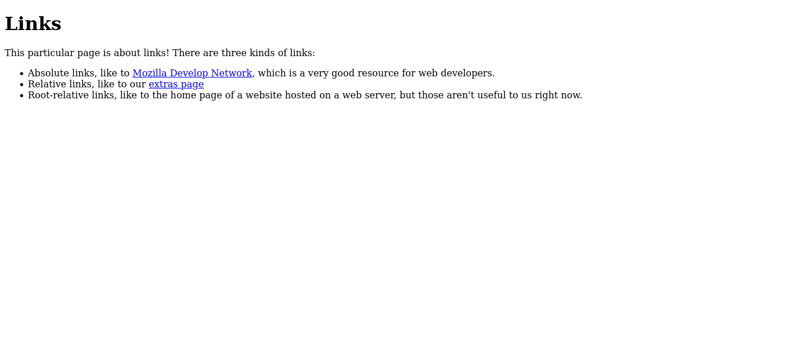
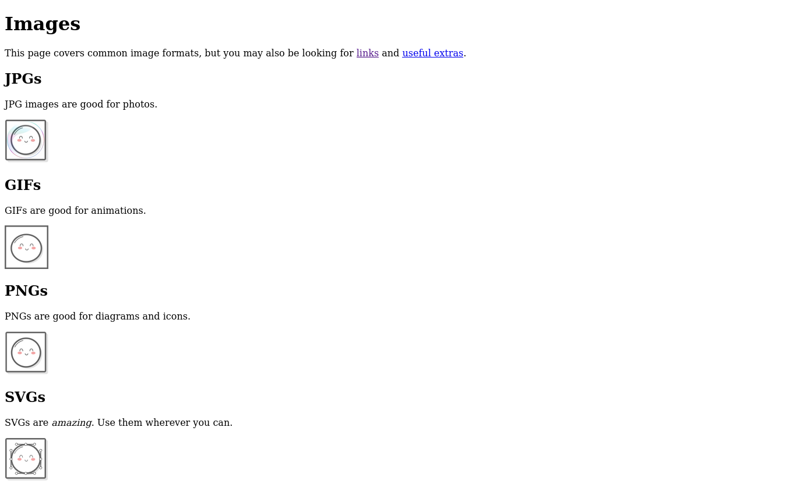
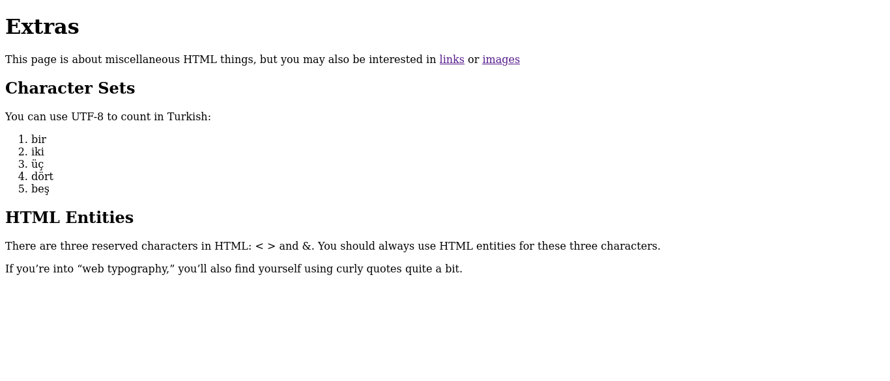

# Interneting Is Hard - Links and Images

This is a solution to the [Links and Images tutorial No. 3 of HTML & CSS Is Hard](https://www.internetingishard.com/html-and-css/links-and-images/). The tutorial does not include an index.html; this was added for the live site on GitHub.

## Table of contents

- [Overview](#overview)
  - [Screenshots](#screenshots)
  - [Links](#links)
- [My process](#my-process)
  - [Built with](#built-with)
  - [What I learned](#what-i-learned)
  - [Continued development](#continued-development)
- [Author](#author)
- [Acknowledgments](#acknowledgments)

## Overview

### Screenshots





### Links

- Solution URL: [Links and Images Solution](https://github.com/jugglingdev/links-and-images)
- Live Site URL: [Links and Images Live Site](https://jugglingdev.github.io/links-and-images/)

## My process

### Built with

- HTML5 markup

### What I learned

This was a fun project.  I really appreciate how the tutorial explained the differences between gif (animations), jpg (photos), png (diagrams and icons), and svg (pure awesomeness) images.

Grouping links and images in the same lesson at first seemed like a lot, but looking back, it makes sense since you use relative links for images.

Something I had seen before - and had honestly been curiously irritated about - was the use of so many hyphens and underscores in titles.  Now I get why spaces are avoided when naming files.  No one wants to see those `%20`s.

I also really appreciate that the `alt` attribute was included.  This was something I learned about in college managing websites for the sake of accessibility.  It was nice to see it's regarded as necessary.

The hardest thing to remember longer than a day or two right now is HTML entities.  They feel a bit cluttered to read and I think I'll have to type them a lot over several weeks to really lock them in my memory.

Some code snippets I want to note are:

```html
<!-- Anchor elements use href attributes -->
<a href="https://github.com">GitHub</a>
```

```html
<!-- Image elements use src and alt attributes -->

```

```html
&lt; is for <
&gt; is for >
&amp; is for &
```

### Continued development

Since this tutorial did not utilize root-relative links, I would like to incorporate those in a future project.  That will require learning more about hosting as well.

I'm also curious about working with character sets other than UTF-8.  It makes me wonder what else is out there.

## Author

- GitHub - [@jugglingdev](https://github.com/jugglingdev)

- freeCodeCamp - [@jugglingdev](https://www.freecodecamp.org/jugglingdev)

- Frontend Mentor - [@jugglingdev](https://www.frontendmentor.io/profile/jugglingdev)

- LinkedIn - [Kayla Paden](https://www.linkedin.com/in/kayla-marie-paden)

## Acknowledgments

Shoutout to Oliver James for his dedication to publishing and maintaining InternetingIsHard.com.  His tutorials were the first that really clicked for me.